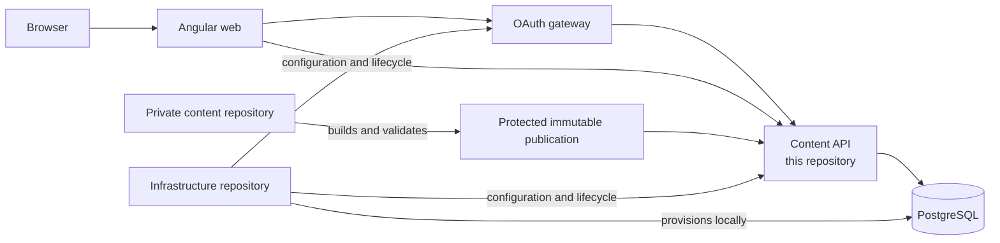
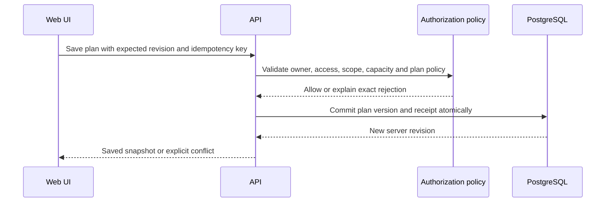
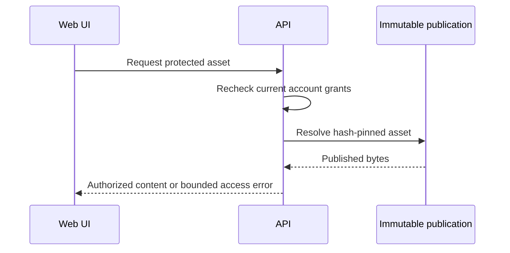

# Look Ahead Content API

A Java 21 / Spring Boot API for account-owned study plans. It stores immutable plan
versions in PostgreSQL, tracks progress and notes, rejects stale concurrent writes,
and makes retries idempotent. Authentication uses sessions and CSRF protection;
synthetic password login is available only in explicit local test mode.

You can build, test and explore this repository without the frontend, a private
content checkout, or AWS credentials. A small synthetic catalog is included.

## Platform highlights

Look Ahead combines Learn foundations, Grow production practice, and Look Ahead
architecture and leadership preparation with unified Search, guided practice,
730 ranked canonical DSA problems, and adaptive Study Plans. This service owns
the account and protected-content boundary behind those experiences. The full
curriculum and 450 ready-made Study Plan templates remain in the private content
repository; this public API repository contains only redistributable contracts
and synthetic fixtures.

## Architecture and repository relationships



| Repository | Relationship to this service |
| --- | --- |
| **`lookahead-learning-web-public`** | Consumes the HTTP contracts; it can also run without this API using synthetic browser-local data. |
| **`lookahead-learning-api`** | Owns application code, SQL migrations, account authorization, protected reads, plan versions, progress, recovery and API-level idempotency. |
| **`lookahead-learning-infra`** | Supplies local PostgreSQL, service configuration, OAuth gateway, mail capture, lifecycle and recovery orchestration. It does not own application migrations. |
| **`lookahead-learning-content`** | Privately authors and validates curriculum and immutable publication fragments. It never supplies account or runtime secrets. |

## Main service flows

Account writes use an owner-scoped revision and idempotency boundary:



Protected content remains separate from saved plan references:



Saving a plan never grants permanent access to paid content. Expired access keeps
the plan and progress intact while protected reads continue to enforce current
entitlements.

## Choose a runnable mode

| Mode | Requirements | What you can exercise |
| --- | --- | --- |
| Operational foundation | Java 21+ | Status, readiness/liveness and OpenAPI; account endpoints are disabled |
| Local account demo | Java 21+, PostgreSQL 17+, Python 3.10+ | Login, account isolation, plan/version persistence, notes, recovery and revision/idempotency checks using synthetic data |

The first mode demonstrates service operation. Use the account demo to evaluate
the persistence and authentication implementation.

## Run locally with the whole platform

For the integrated development stack, keep this checkout beside
`lookahead-learning-infra` and `lookahead-learning-web-public`. The infrastructure
repository builds and runs this service as `lookahead-local-api` on loopback port
`4320`, connects it to its private PostgreSQL network, and runs the OAuth gateway
on `4330`. The UI runs separately on `4316`.

From the infrastructure repository, follow `docs/local-accounts.md`, then
`docs/oauth-local.md`. From the web repository run:

```shell
npm run start:connected -- --host 127.0.0.1 --port 4316
```

The integrated stack is a local development environment. It does not claim AWS
identity, networking, TLS, managed failover, or production performance.

## Quick start: operational foundation

The Maven Wrapper is included; no global Maven installation is needed. Initial
builds download Maven and dependencies.

```sh
./mvnw --batch-mode --no-transfer-progress clean verify
java -jar target/lookahead-content-api.jar \
  --server.address=127.0.0.1 --server.port=8081
```

Choose a free port if 8081 is occupied. In another terminal:

```sh
curl --fail http://127.0.0.1:8081/api/v1/status
curl --fail http://127.0.0.1:8081/actuator/health/readiness
```

Open [Swagger UI](http://127.0.0.1:8081/swagger-ui.html) to inspect the API. Stop the
foreground process with Ctrl+C. To develop without rebuilding the JAR each time:

```sh
./mvnw spring-boot:run \
  -Dspring-boot.run.arguments="--server.address=127.0.0.1 --server.port=8081"
```

## Full local account demo

Follow the [standalone account walkthrough](docs/standalone-accounts.md). It uses
an externally provisioned local PostgreSQL database, API-owned role/schema SQL,
a generated local secret directory and the included synthetic catalog. No
frontend or other repository is required.

The walkthrough covers fresh database setup, migration, local seed configuration,
startup and the HTTP verification suite. Runtime and migration roles are separate;
normal startup does not reset users, grants or stored plans.

## Implementation highlights

- Controllers, DTOs, services, repositories, validators, filters and exception
  handlers have separate packages and responsibilities.
- Database writes enforce account ownership, expected revisions and transactional
  idempotency receipts. Snapshots retain their original version metadata.
- Session completion and canonical content completion are distinct. Notes and
  explicit recovery versions remain attached to the owning account and plan.
- A backend-controlled metadata catalog validates content references and routes;
  caller-provided topic lists cannot grant access.
- Database outages affect readiness while process liveness stays independent.

See the [architecture](docs/architecture.md), [HTTP contract](docs/account-api.md)
and [Local / DEV / PROD environment guide](docs/environments.md).

## Test and package

```sh
./mvnw --batch-mode --no-transfer-progress clean verify
python3 -m unittest discover -s tools/accounts -p 'test_*.py'
```

Maven tests use synthetic fixtures and do not need a PostgreSQL service. The
separate HTTP suite in the account walkthrough requires a running local account
API and database. It creates and cleans up its own test plans; it does not certify
a frontend scheduler or production identity provider.

## Build and inspect the container

Docker is optional for host development. Build a dedicated demo tag to avoid
replacing another application's local image:

```sh
docker build --tag lookahead-content-api:demo .
sh tools/container/smoke.sh lookahead-content-api:demo
docker run --rm --name lookahead-api-demo \
  -p 127.0.0.1:8081:8080 \
  lookahead-content-api:demo
```

The image defaults to the database-free `prod` operational profile. The smoke
helper creates a throwaway container with no published port, checks non-root
readiness, then removes only that container. The production runtime runs as UID
10001; build tools and tests remain in the build stage.

Docker receives only the source, Maven inputs and health probe needed by the
build. Local environment files, keys, private notes and runtime state are excluded.
Base-image tags can change upstream; release processes should pin reviewed digests.

## Environment boundaries

`local-accounts` enables the local demo; `dev` and `production` reserve distinct
shared environments. DEV and PROD disable synthetic password login. Production
identity, shared sessions, deployment infrastructure and target-environment
verification are still required before a production account service can launch.

Platform-wide infrastructure orchestration lives separately from this API. The
standalone walkthrough needs only PostgreSQL's documented local service contract.
Actual credentials belong in ignored local files or a deployment secret provider.
Use explicit safe example files when adding configuration; never commit runtime
secrets or proprietary catalogs.

## Continuous integration

The included workflow verifies the JAR and configuration helper tests, builds the
image, and runs the non-root readiness smoke check.

### Cucumber acceptance tests

Run `./mvnw -Dtest=CucumberAtddTest test` for Java component features using mocked storage, without Docker. See [Cucumber tests](docs/cucumber-tests.md) for feature locations, Java steps, optional live discovery, and coverage boundaries.

Email registration is opt-in and uses required profile data with explicit country selection. The local infrastructure stack enables it. See [email account registration](docs/account-registration.md) for routes, availability, migration, and session behavior. Google OIDC remains a separate pending integration.

First-party OAuth and a confidential browser gateway are available through the
`oauth-server` and `gateway` profiles. See [OAuth and gateway contracts](docs/oauth-gateway.md)
for exact routes, token validation, secret configuration and operational limits.

## Optional local author capability

When the integrated account stack enables `app.local-test.author-enabled=true`,
the reserved `author@lookahead.test` synthetic account receives all current
trusted-catalog topic grants and an `authorPreview` capability in its account
response. It uses the configured local seed secret; no password is hardcoded.
The existing local seeding guard requires `accounts,local-test`, deployment
`local`, and explicit seeding, and rejects production combinations. A conflicting
username cannot promote an existing account. Restarts preserve the author's
password and plans while adding new published scopes. Content authorization and
account-owned plan isolation use the normal repositories and policies.

This capability supports the web author workspace; it does not provide
cross-account administration or production author identity management.
