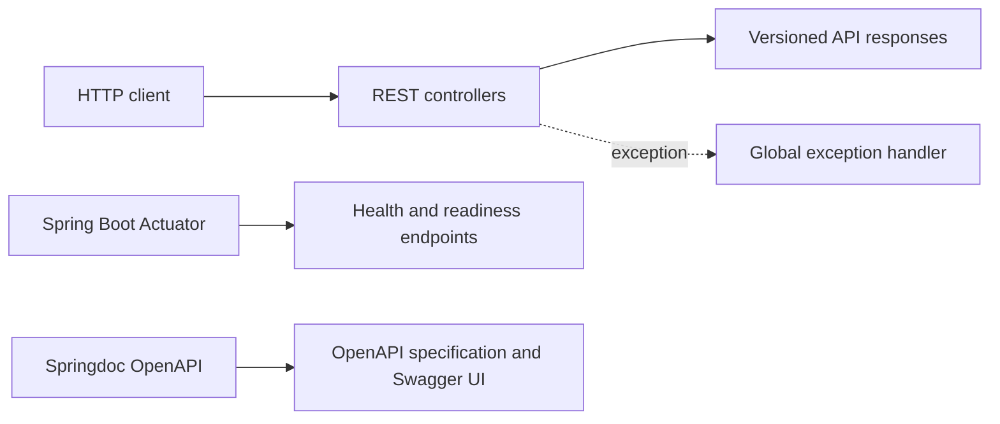
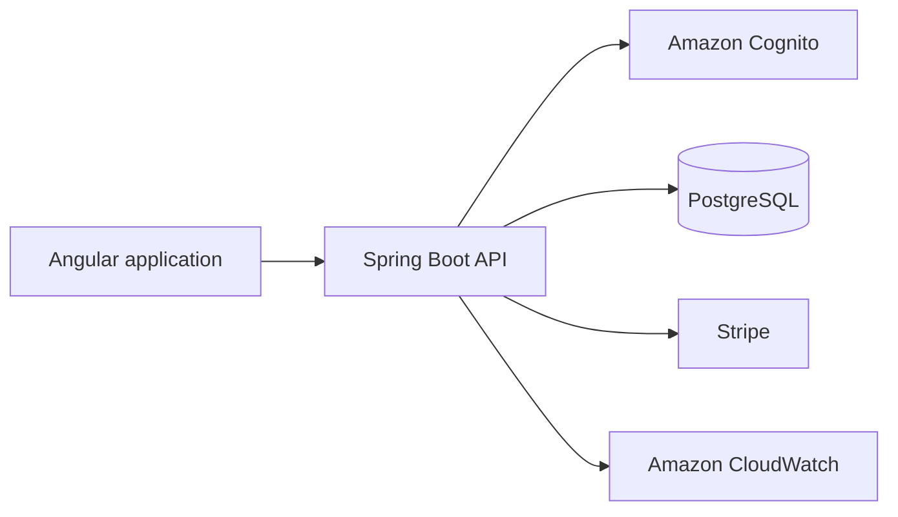

# Backend architecture

## Current scope

The backend is a stateless Spring Boot REST API. Phase 1 deliberately contains no database, identity provider, payment provider, or interview-content repository.

## Package responsibilities

| Package | Responsibility |
| --- | --- |
| `api` | Versioned controllers and transport models |
| `config` | CORS, OpenAPI, and application configuration |
| `exception` | Consistent public API error responses |

Future domain logic will be separated into `service`, `model`, and `repository` packages when a use case requires them.

## Planned evolution

- Angular initially owns public interview content as version-controlled JSON.
- Cognito will provide Google sign-in through OAuth 2.0/OpenID Connect.
- PostgreSQL will hold profiles, bookmarks, progress, and entitlements.
- Stripe will process payments; the application will not store card data.
- Premium content will be returned only by authorized API endpoints.

## API conventions

- Public endpoints are versioned under `/api/v1`.
- Successful responses use an envelope containing `data` and `timestamp`.
- Errors use a stable structure containing HTTP status, message, path, details, and timestamp.
- Configuration is externalized through Spring profiles and environment variables.
