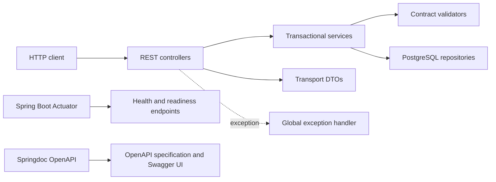

# Content API architecture

## Current scope

One modular Spring Boot API supplies the stateless operational foundation and an
opt-in account module. The account module owns guarded local-test identity, opt-in email registration and explicit profile storage, PostgreSQL
study plans, immutable versions, per-plan activity/progress/notes, migrations and
trusted metadata validation. Session state is in memory; account data is durable.
The [account API contract](account-api.md) describes the implemented boundary.

## Package responsibilities

| Package | Responsibility |
| --- | --- |
| `controller` | HTTP routes, authentication context and response construction |
| `dto` | Public request/response transport records and envelopes |
| `service` | Account lookup and transactional plan orchestration |
| `repository` | Owner-scoped SQL queries, writes, row mapping and locks |
| `model` | Internal persistence records, including credentials never returned by controllers |
| `validator` | Snapshot contracts, metadata/access checks, import mapping and local seed guards |
| `handler` | Public exception-to-HTTP error mapping |
| `exception` | Typed application failures |
| `filter` | Request size limits and stale-account request protection |
| `security` | Authenticated principal representation |
| `config` | Security, database, CORS and OpenAPI wiring |
| `health` | Database/schema readiness checks |
| `migration` | Separate schema-migration entrypoint |
| `seed` | Guarded, idempotent local test-account bootstrap |
| `util` | Focused JSON canonicalization/hashing and bounded payload readers |
| `accounts` | Compatibility migration launcher for existing Infra jobs only |

Controllers call services, services coordinate validators and repositories, and
repositories own SQL. `PlanService` keeps the transaction boundary; splitting
persistence into `PlanRepository` does not change account ownership checks,
revision locks or idempotency semantics. Transport DTOs are separate from database
records. Utilities contain narrowly reusable operations, not business workflows.
Tests mirror production responsibility packages. The old migration launcher can
be removed only after Infra adopts the new entrypoint.

Each mutation locks its owner/key and expected revision in one PostgreSQL
transaction. Version rows preserve snapshot JSONB, provenance and validated
session-to-canonical membership; typed activity rows record separate operations.
Current progress is a JSONB projection owned by the plan. Runtime and migration
database roles are separate. Infra owns containers, secrets and volume lifecycle.

## API conventions

- Public endpoints are versioned under `/api/v1`.
- Successful responses use an envelope containing `data` and `timestamp`.
- Errors use a stable structure containing HTTP status, message, path, details, and timestamp.
- Configuration is externalized through Spring profiles and environment variables.

## Local container foundation

The sibling infrastructure repository owns local orchestration. This repository
owns the source-built Java 21 image, non-root runtime and readiness/liveness
contracts. The container uses its production Spring profile so local checks can
exercise graceful shutdown and production log settings without provisioning AWS.

`/actuator/health/readiness` controls readiness and the image healthcheck.
`/actuator/health/liveness` describes process liveness. In the account profile,
readiness also checks authenticated runtime-role database/schema availability.
Database outages do not fail liveness or trigger process-restart loops.

The account module supplies account-owned saves/imports, retry receipts, revision
conflicts and explicit versioned recovery. Production identity, shared sessions
and cloud resources remain separate integration work.

## Environment configuration

See [local development and production](environments.md) for supported profiles,
secret injection, the migration/runtime boundary and production rollout prerequisites.

Email registration adds API-owned migration V4 (`account_profiles`) and a CSRF-protected registration endpoint. Registration creates the normal server session and no paid grants; Google and automatic identity linking remain unavailable. See [account registration](account-registration.md).
