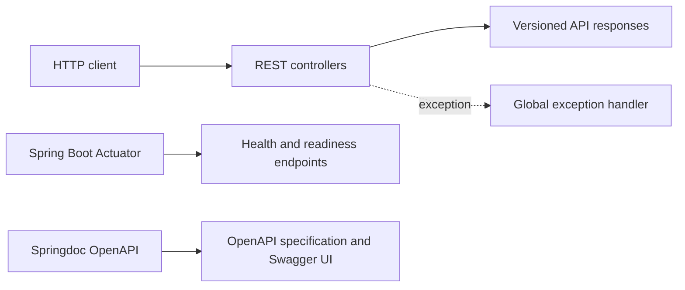
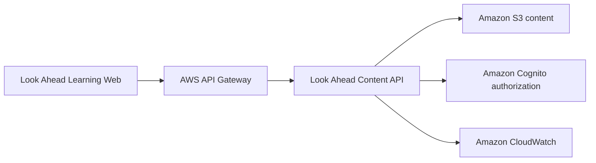

# Content API architecture

## Current scope

The Content API is a stateless Spring Boot REST API. Its bounded context is learning-path, course, question, and content delivery. The current foundation deliberately contains no database, identity provider, or payment provider.

## Package responsibilities

| Package | Responsibility |
| --- | --- |
| `api` | Versioned controllers and transport models |
| `config` | CORS, OpenAPI, and application configuration |
| `exception` | Consistent public API error responses |

Future domain logic will be separated into `service`, `model`, and `repository` packages when a use case requires them.

## Planned evolution

- Angular initially loads public learning content from version-controlled JSON.
- Amazon S3 and CloudFront will deliver published public content.
- Cognito tokens will identify users requesting protected content.
- A separate User API will own profiles, bookmarks, progress, and entitlements in PostgreSQL.
- Premium content will be returned only after server-side authorization.

## API conventions

- Public endpoints are versioned under `/api/v1`.
- Successful responses use an envelope containing `data` and `timestamp`.
- Errors use a stable structure containing HTTP status, message, path, details, and timestamp.
- Configuration is externalized through Spring profiles and environment variables.
